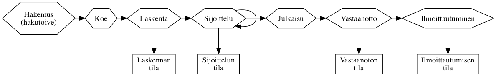
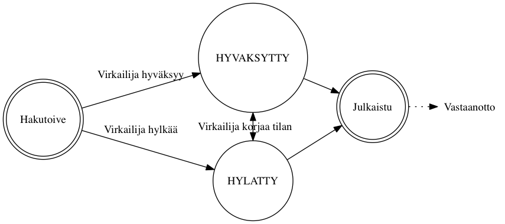
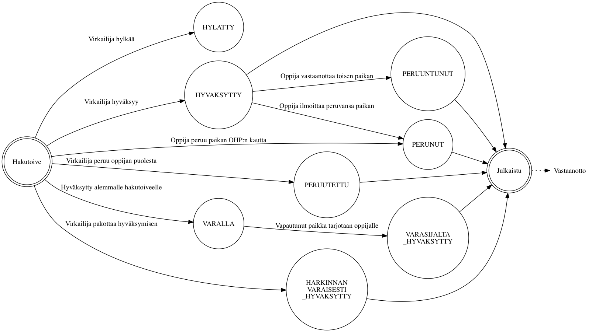

*Tämä dokumentti on koostettu kehityksen avuksi. Tämä dokumentti ei ole
virallinen vaatimusmäärittely.*

# Valintaprosessi ja hakemuksen ja vastaanoton tilasiirtymät

*Haku* sisältää [*hakukohteita*](#hakukohde). Kun *hakija* hakee
hakukohteisiin, hän asettaa [*hakemuksessa*](#hakemus) listan
[*hakutoiveita*](#hakutoive). Valintaprosessi käy haun hakemukset läpi, kerää
hakijoiden hakutoiveet ja etenee [*valintalaskennan*](#valintalaskenta) ja
[*sijoittelun*](#sijoittelu) läpi. Hakukohteilla on määritetty
*valintatapajonot* joiden *valintaperusteet* määrittävät säännöt joilla
hakijat kerätään valintatapajonoihin.

Valintatapajonolle määritetään käytetäänkö valintatapajonossa valintalaskentaa
(tai manuaalinen import) ja siirretäänkö valintatapajono mukaan sijoitteluun.
Valintatapajonolle määritetään *kiintiö*, eli *vastaanotettavien* *paikkojen*
määrä.

Valintaprosessi voi edetä haun ja hakukohteen ja hakukohteen valintatapajonon
asetuksista riippuen automaattisesti tai *virkailijan* manuaalisesti
edistämänä. Hakutoiveen etenemistä kuvataan joukolla *tiloja*. Tilojen väliset
tilasiirtymät voivat tapahtua joko automaattisesti järjestelmän tekemänä tai
virkailijan tai hakijan toimesta, riippuen haun asetuksista ja mikä
tilasiirtymä on kysessä.

Alla oleva kuva näyttää valintaprosessin kaikkien vaiheiden keskinäisen
järjestyksen sekä mahdollisen tilan joka kuvaa kyseistä vaihetta tarkemmin.
Käytetyt vaiheet riippuvat haun asetuksista.

## Hakutyypit

Valintaprosessissa käytettävät vaiheet ja niiden käytännöt vaihtelevat hausta
toiseen. Tässä on kuvattu erilaisia hakutyyppejä ja niiden käyttötilanteita.

### Yhteishaku

Yhteishaku tarkoittaa *korkeakoulujen yhteishakua* tai *2. asteen yhteishakua*
ammatillisiin- ja lukiokoulutuksiin. Yhteishaussa on tarjolla paljon
[hakukohteita](#hakukohde) joista hakija voi valita haussa määritellyn määrän
[hakutoiveita](#hakutoive) samalla [hakemuksella](#hakemus).

- **Varsinainen haku**: Hakijat pyrkivät saamaan paikan varsinaisessa haussa.
  Haussa käytetään automaattista valintalaskentaa ja sijoittelua.
  Automaattisen valintalaskennan sijaan virkailija voi myös tuoda *hylätyt* ja
  *hyväksyttävissä* olevat hakijat paremmuusjärjestyksessä excelillä tai
  json-rajapinnalla.
- **Lisähaku**: Hakijat jotka eivät saaneet vastaanotettua
  [paikkaa](#paikka) varsinaisessa haussa voivat hakea lisähaussa oleviin
  [hakukohteisiin](#hakukohde). Lisähaussa virkailija hallinnoi valinnan
  vaiheita manuaalisesti.

### Erillishaku

Erillishaku tarjoaa koulutuksia joihin ei haeta yhteishaussa. Opiskelupaikat
voivat järjestää erillishakuja haluaminaan ajankohtina. Kuhunkin
[hakukohteeseen](#hakukohde) haetaan erillisellä [hakemuksella](hakemus)
toisin kuin yhteishaussa.

- Voi olla kuten yhteishaun varsinainen haku
- Voi olla ilman sijoittelua, jolloin laskennan yhteydessä hakijat
  sijoitellaan yhden hakukukohteen sisällä paremmuusjärjestykseen
- Voi olla ilman valintalaskentaa ja ilman sijoittelua, virkailija tuo
  excelillä tai käyttöliittymässä hakijoiden *valinnan tilat*
- Virkailija voi tuoda myös hakijoiden hakemukset jos haku on ollut muualla
  kuin *opintopolussa*

## Sanasto

- <a name="virkailija">**Virkailija**</a>: Hakua organisoiva henkilö.
- <a name="hakemus">**Hakemus**</a>: Hakijan hakuun lähettämät taustatiedot ja
  [hakutoiveet](#hakutoive). Hakemuksen sisältö ja hakutoiveiden mahdollinen
  määrä riippuu hausta ja hakutoiveista.
- <a name="hakukohde">**Hakukohde**</a>: Oppilaitoksen haussa tarjoama
  koulutus johon hakijat kohdistavat hakemuksessaan
  [hakutoiveita](#hakutoive).
- <a name="julkaisu">**Julkaisu**</a>: Virkailija merkitsee [valinnan
  tilan](#valinnan-tila) lopulliseksi jolloin se tulee hakijan nähtäväksi
  [OHP:ssa](#ohp) kyseiselle [hakutoiveelle](#hakutoive). Hakija voi tämän
  jälkeen tehdä päätöksen vastaanotosta jos hänelle tarjoutuu [paikka](#paikka).
- <a name="valintalaskenta">**Valintalaskenta**</a>: Valintaprosessin vaihe jossa
  hakijan hakemuksessa antamista tai kokeesta tulleista pisteistä tuotetaan
  lista hajioiden keskenäisestä järjestyksestä. Laskentaa varten on luotu
  laskentakaava joka määrittää lähtötiedoista lopullisen järjestyksen.
- <a name="kausi">**Kausi**</a>: Koulutuksen alkamisajankohta, kevät tai syksy.
- <a name="sijoittelu">**Sijoittelu**</a>: Hakukohtainen toistettava vaihe jossa
  [valintalaskennan](#valintalaskenta) tulosten mukaan hakijat on ryhmitelty
  [*hyväksytyksi*](#hyvaksytty) tai kiintiöön mahtumattomana *varalle*
  (poikkeustapauksissa *hylätyksi*). Hyväksyttyjen hakijoiden
  [vastaanottopäätösten](#vastaanoton-tila) perusteella sijoittelu voi nostaa
  varalla olleita hakemuksia hyväksytyiksi. Sijoittelua suoritetaan niin
  kauan kun hakijat voivat muuttaa *vastaanoton tilaa*.
- <a name="hakutoive">**Hakutoive**</a>: Hakijan hakemukselle syöttämä
  opiskelupaikka johon hän haluaa tulla [hyväksytyksi
  valinnassa](#valinnan-tila). Hausta riippuen hakutoiveiden keskinäisellä
  järjestyksellä voi olla merkitystä.
- <a name="paikka">**Paikka**</a>: Hakijan toteutunut, eli [hyväksytty](#hyvaksytty),
  [hakutoive](#hakutoive) josta hakija tekee [vastaanottopäätöksen](#vastaanoton-tila).
- <a name="ohp">**OHP**</a>: Oppijan Henkilökohtainen Palvelu, tai "omat sivut", on
  hakijoiden käyttöliittymä josta voi muokata lähettämiään hakemuksia ja
  hallita omia [hakutoiveita](#hakutoive). Kun haun [valinnan
  tila](#valinnan-tila) on [julkaistu](#julkaisu) virkailijoiden toimesta,
  hakija voi hyväksytyssä tapauksessa tehdä päätöksen hakutoiveensa
  [vastaanotosta](#vastaanoton-tila) ja [ilmoittaa
  läsnäolonsa](#ilmoittautumisen-tila) palvelun kautta.

## Valintakoelaskenta

Kutsutaan hakijan samaa koetta käyttävistä hakutoiveista ylimpään
hakutoiveeseen tai kaavan mukaan esim. äidinkielen
mukaan kielikokeeseen.

### Välisijoittelu

Käytetään jos kaikkia hakijoita ei kutsuta valintakokeeseen vaan osa
hakijoista kutsutaan kokeeseen siihen hakukohteeseen johon kaavan mukaiset
pisteet riittävät.

## Valintalaskennan tila

Jos haussa käytetään [sijoittelua](#sijoittelu), suoritetaan hakijoiden kesken
[valintalaskenta](#valintalaskenta). Laskenta valitsee ne [hakijoiden
hakutoiveet](#hakutoive) jatkoon jotka ylittävät kyseisen hakukohteen asettamat
vaatimukset, esimerkiksi pääsykoepisteiden alarajan.

- `HYVAKSYTTAVISSA`: Hakutoive pääsee automatisoidusti jatkoon hakukohteelle
  määritellyn *laskentakaavan* pohjalta
- `HYLATTY`: Hakijan lähtotiedot eivät riittäneet jatkoon
- `MAARITTELEMATON`: Tila estää sijoitteluun etenemisen, ei voi syntyä
  laskennassa, oletusarvo ilman laskentaa tehtävässä haussa
- `VIRHE`: Laskentaa käytettäessä kun syötetiedoissa virhe
- `HYVAKSYTTY_HARKINNANVARAISESTI`: Virkailija päästää poikkeustapauksessa
  hakutoiveen manuaalisesti jatkoon

## Valinnan tila

Synonyymit: valintatila, hakemuksen tila, sijoittelun tila, hyväksymisen tila

Jos haku käyttää [sijoittelua](#sijoittelu), *valinnan tila* päivittyy seuraavalla
*sijoittelukerralla* sitä mukaa kun hyväksytyt hakijat päättävät
[vastaanotosta](#vastaanoton-tila). Sijoittelu suoritetaan yleensä vähintään
kerran päivässä niin kauan kun hakijat voivat tehdä vastaanottopäätöksiä.
Ensisijaisesti valituksi tulleiden opiskelijoiden vastaanottopäätösten
seurauksena vapautuvia paikkoja annetaan *varalla* oleville hakijoille.
Hakija voi tehdä vastaanoton vasta kun virkailija on [julkaissut](#julkaisu)
tiedon valinnan tilasta. Jos haku ei käytä sijoittelua, virkailijat asettavat
valinnan tilan käsin.

- `VARALLA`: Odottaa muiden hakijoiden *perumisista* vapautuvia paikkoja
- `HYLATTY`: Hakutoive on hylätty virkailijan toimesta eikä hakija ei voi
  tulla valituksi kohteeseen
- <a name="hyvaksytty">Hyväksytyt</a> tilat mahdollistavat hakijan
  [vastaanottaa](#vastaanoton-tila) tarjottu [paikka](#paikka).
  - `HYVAKSYTTY`: Mahtunut hakukohteen asettamaan *kiintiöön* ja hakija voi tehdä
    vastaanottopäätöksen
  - `HARKINNANVARAISESTI_HYVAKSYTTY`: Siirretty virkailijan toimesta
    hyväksytyksi ja hakija voi tehdä vastaanottopäätöksen. Käytössä vain *2.
    asteen haussa*.
  - `VARASIJALTA_HYVAKSYTTY`: Nostettu *varasijalta* hyväksytyksi kun paikkoja on
    vapautunut
- <a name="peruttu">Perutut</a> tilat syntyvät jos [hyväksyttyä](#hyvaksytty)
  paikkaa jää [vastaanottamatta](#vastaanoton-tila).
  - `PERUNUT`: Hakija peruu itse tai ilmoittaa että ei ota [paikkaa](#paikka) vastaan. Jos
    vastaanottoa ei suoriteta *määräaikana* valinta menee tähän tilaan. Estää
    sijoittelun tekemästä tilamuutoksia.
  - `PERUUTETTU`: Oppilaitos peruu (hylkää) jo hyväksytyn paikan. Estää
    sijoittelun tekemästä tilamuutoksia.
  - `PERUUNTUNUT`: Hakijan *korkeamman prioriteetin* hakutoive on mennyt
    `HYVAKSYTTY` tilaan jolloin tämä hakutoive peruuntuu

### Valinta ilman sijoittelua

### Valinta sijoittelun kanssa

## Vastaanoton tila

Synonyymit: vastaanotto, valintatuloksen tila, vastaanottotieto

Kun hakijan [valinnan tila](#valinnan-tila) on määäritetty virkailijan tai
[sijoittelun](#sijoittelu) toimesta, virkailija [julkaisee](#julkaisu) tiedon hakijalle.
Tällöin [valinnan tila](#valinnan-tila) ilmestyy hakijalle [OHP:hen](#ohp),
edelleen mahdollistaen paikan *vastaanoton tilan* asettamisen siinä
tapauksessa että hakutoive on hyväksytty.

Kielteisen valinnan tilan seurauksena *vastaanoton tila* on saatettu jo
asettaa valmiiksi, muutoin *vastaanoton tila* asetetaan hakijan ilmoituksen
mukaan joko virkailijan tai hakijan itsensä toimesta.

- Tilat joita käytetään hakutyypistä riippumatta
  - `KESKEN`: Odottaa hakijan vastaanottopäätöstä
  - `EI_VASTAANOTETTU_MAARA_AIKANA`: Hakija ei ilmoittanut
    vastaanottopäätöstään määräaikaan mennessä
  - `PERUNUT`: Hakija itse peruu vastaanoton OHP:n kautta
  - `PERUUTETTU`: Virkailija on perunut vastaanoton hakijan puolesta

- Vain toisen asteen hauissa käytettävät tilat
  - `VASTAANOTTANUT`: Hakija ilmoittaa vastaanoton 2. asteen haussa

- Vain korkeakouluhauissa käytettävät tilat
  - `EHDOLLISESTI_VASTAANOTTANUT`: KK-hakija vastaanottaa paikan jos
    korkeamman prioriteetin hakutoivetta vastaava [paikka](#paikka) ei vapaudu
    määräaikaan mennessä
  - `VASTAANOTTANUT_SITOVASTI`: KK-hakija sitoutuu paikan vastaanottoon ja
    hylkää muut hakutoiveensa

- Tilat joita ei käytetä enää nykyisissä tai tulevissa hauissa
  - `ILMOITETTU`: Ei käytetä enää, vanhoissa ennen 2014 2. asteen haussa
    vastasi julkaistavuustietoa
  - `VASTAANOTTANUT_LASNA`: Ei käytetä enää, vanhoissa ennen 2014 2. asteen
    haussa vastasi julkaistavuustietoa
  - `VASTAANOTTANUT_POISSAOLEVA`: Ei käytetä enää, vanhoissa ennen 2014 2.
    asteen haussa vastasi julkaistavuustietoa

## Ilmoittautumisen tila

Synonyymit: ilmoittautuminen, ilmoittautumistila, ilmoittautumistieto

Jos hakija on [vastaanottanut](#vastaanoton-tila) paikan johon hänet on
[hyväksytty](#hyvaksytty), ilmoittaa
hän viimeiseksi *läsnäolotietonsa*. Kaikki ilmoittautumistilat ovat käytössä
sekä 2. asteen että korkeakoulujen hauissa. Soveltuvat tilat riippuvat
koulutuksen [alkamiskaudesta](#kausi). Käyttöliittymät eivät toistaiseksi
välttämättä huomioi kautta oikein.

- `EI_TEHTY`: Alkutila
- `LASNA_KOKO_LUKUVUOSI`: vain kevään haussa
- `POISSA_KOKO_LUKUVUOSI`: vain kevään haussa
- `EI_ILMOITTAUTUNUT`: Virkailija tallentaa tilan jos hakija ei tehnyt
  ilmoittautumista määräaikaan mennessä
- `LASNA_SYKSY`: Läsnä syksyn, poissa kevät
- `POISSA_SYKSY`: Poissa syksyn, läsnä kevät
- `LASNA`: Läsnä, keväällä alkava koulutus - vain syksyn haussa
- `POISSA`: Poissa, keväällä alkava koulutus - vain syksyn haussa

# Koodaajan synonyymit

| Virallinen nimi       | Käyttöliittymä                                                    | Koodi | Tietokanta |
| --------------------- | ----------------------------------------------------------------- | ----- | ---------- |
| Valintalaskennan tila |                                                                   | JarjestyskriteerituloksenTila       | valintalaskentadb: ValinnanVaihe.valintatapajonot -> Valintatapajono.jonosijat.jarjestyskriteeritulokset.tila
| Valinnan tila         | valintatila, hakemuksen tila, sijoittelun tila, hyväksymisen tila | HakutoiveenValintatapajonoDTO.tila | sijoitteludb: Hakukohde.valintatapajonot.hakemukset.tila
| Vastaanoton tila      | vastaanotto, valintatuloksen tila, vastaanottotieto               | sijoittelu-algoritmi-domain: Valintatulos.tila | sijoitteludb: Valintatulos.tila
| Ilmoittautumisen tila | ilmoittautuminen, ilmoittautumistila, ilmoittautumistieto         | sijoittelu-algoritmi-domain: Valintatulos.ilmoittautumisTila | sijoitteludb: Valintatulos.ilmoittautumisTila

# Dokumentaation kehitys

## Kaavioiden luonti

Kaaviot kuvataan tekstimuotoisissa `.dot` tiedostoissa. Ne muunnetaan kuviksi
[Graphviz työkalulla](http://www.graphviz.org/). Kaikki `.dot` tiedostot voi
muuntaa kuviksi ajamalla oheinen `./render-graphs.sh` komento.
