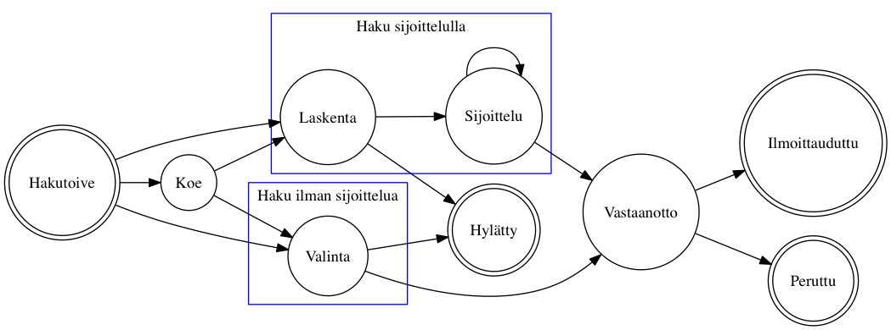
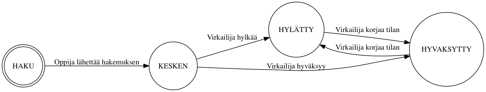
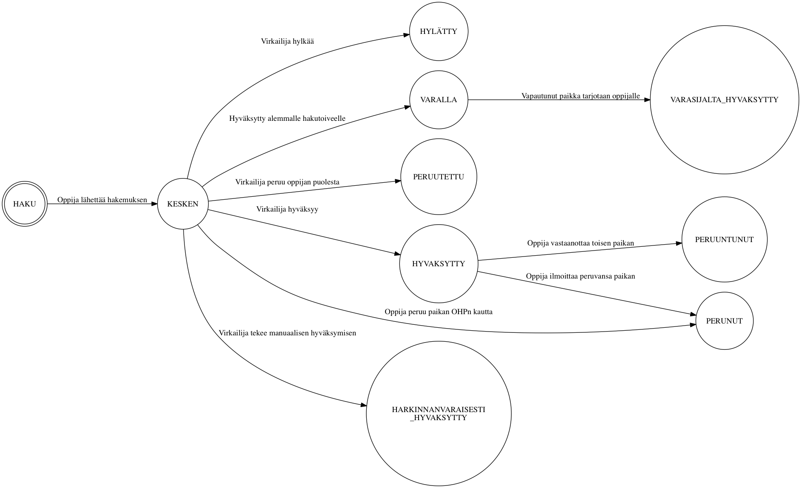
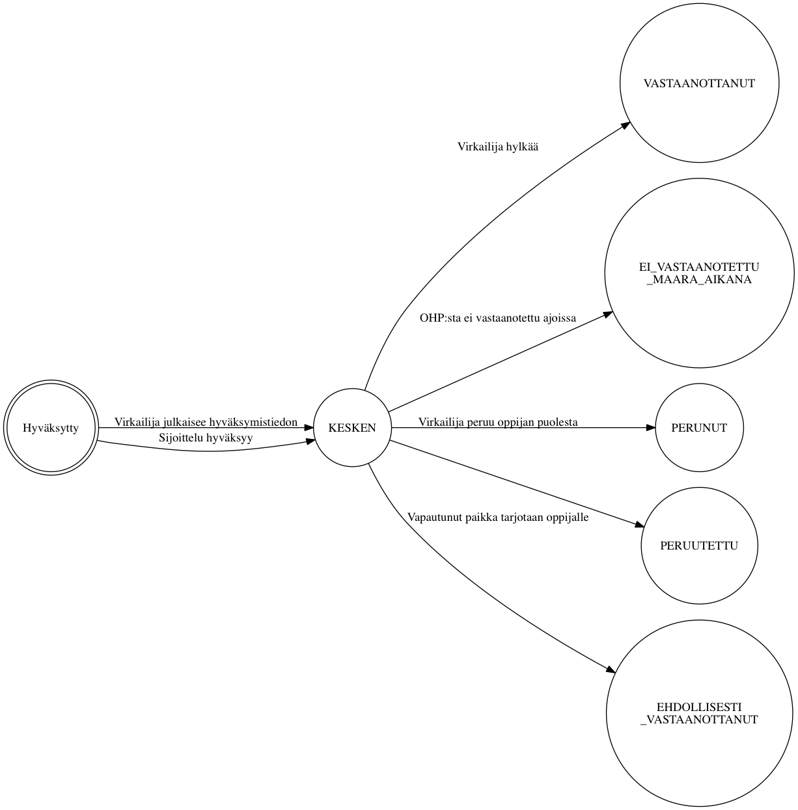

# Hakemuksen ja vastaanoton tilasiirtymät

*Tämä dokumentti on koostettu kehityksen avuksi. Tämä dokumentti ei ole
virallinen vaatimusmäärittely.*

Kun *hakija* hakee *hakukohteeseen*, asettaa hän *hakemuksessa* listan
*hakutoiveta*. Hakutoiveen etenemistä hakuprosessissa kuvataan joukolla
tiloja. Tilojen väliset tilasiirtymät voivat tapahtua joko automaattisesti tai
virkailijan tai opiskelijan toimesta, riippuen siitä minkä tyyppinen haku ja
mikä tilasiirtymä on kysessä.

## Laskennan tulos

Jos haussa käytetään sijoittelua, suoritetaan hakijoiden kesken *laskenta*.
Laskenta valitsee ne hakijat (hakijoiden hakutoiveet) jatkoon jotka ylittävät
kyseisen hakukohteen asettamat vaatimukset, esimerkiksi pääsykoepisteiden
alarajan.

- `HYVAKSYTTAVISSA`: Hakutoive pääsee automatisoidusti jatkoon hakukohteelle
  määritellyn laskentakaavan pohjalta
- `HYLATTY`: Hakijan lähtotiedot eivät riittäneet jatkoon
- `MAARITTELEMATON`: ???
- `HYVAKSYTTY_HARKINNANVARAISESTI`: Virkailija päästää poikkeustapauksessa
  hakutoiveen manuaalisesti jatkoon

## Valintatila / sijoittelun tila

Synonyymit: valintatila, hakemuksen tila, sijoittelun tila, hyväksymisen tila

- `HYVAKSYTTY`: Hakija voi ottaa paikan vastaan
- `HARKINNANVARAISESTI_HYVAKSYTTY`: Hakutoive on siirretty virkailijan toimesta manuaalisesti eteenpäin
- `VARASIJALTA_HYVAKSYTTY`: Hakija voi ottaa paikan vastaan (alunperin varasijalla)
- `VARALLA`: Hakija voi tulla kohteeseen valituksi (jossain vaiheessa)
- `HYLATTY`: Hakija ei voi koskaan tulla valituksi kohteeseen
- `PERUNUT`: Hakija ei ole vastaanottanut paikkaa. Hakija ei voi tulla enää valituksi matalamman prioriteetin kohteissa
- `PERUUTETTU`: Virkailija on perunut paikan. Sama toiminnallisuuks kuil HYLATTY
- `PERUUNTUNUT`: Hakija on tullut valituksi parempaan paikkaan (korkeampi hakutoive)
- `KESKEN`: ??? onko mahdollinen

### Lisähaku

### Erillishaku

## Valintatuloksen tila

Synonyymit: vastaanotto, valintatuloksen tila, vastaanottotieto

Kun hakijan *valintatila* on määäritetty virkailijan tai sijoittelun toimesta,
virkailija *julkaisee* tiedon hakijalle. Tällöin valintatila ilmestyy
hakijalle OHP:hen, edelleen mahdollistaen paikan vastaanottotiedon asettamisen
siinä tapauksessa että hakutoive on hyväksytty.

Kielteisen valintatilan seurauksena vastaanottotieto on saatettu jo asettaa
valmiiksi, muutoin vastaanottotieto asetetaan hakijan ilmoituksen mukaan joko
virkailijan tai hakijan itsensä toimesta.

- `ILMOITETTU`
- `VASTAANOTTANUT`
- `VASTAANOTTANUT_LASNA`
- `VASTAANOTTANUT_POISSAOLEVA`
- `EI_VASTAANOTETTU_MAARA_AIKANA`
- `PERUNUT`
- `PERUUTETTU`
- `EHDOLLISESTI_VASTAANOTTANUT`
- `VASTAANOTTANUT_SITOVASTI`
- `KESKEN`

## Ilmoittautumisen tila (läsnäoloilmoitus)

Synonyymit: ilmoittautuminen, ilmoittautumistila, ilmoittautumistieto

Jos opiskelija on vastaanottanut paikan johon hänet on hyväksytty, ilmoittaa
hän viimeiseksi läsnäolotietonsa.

- `EI_TEHTY`
- `LASNA_KOKO_LUKUVUOSI`
- `POISSA_KOKO_LUKUVUOSI`
- `EI_ILMOITTAUTUNUT`
- `LASNA_SYKSY`: Läsnä syksy, poissa kevät
- `POISSA_SYKSY`: Poissa syksy, läsnä kevät
- `LASNA`: Läsnä, keväällä alkava koulutus
- `POISSA`: Poissa, keväällä alkava koulutus

# Dokumentaation kehitys

## Kaavioiden luonti

Kaaviot kuvataan tekstimuotoisissa `.dot` tiedostoissa. Ne käännetään kuviksi
[Graphviz työkalulla](http://www.graphviz.org/). Kaikki `.dot` tiedostot voi
kääntää ajamalla oheinen `./mk.sh` komento.
