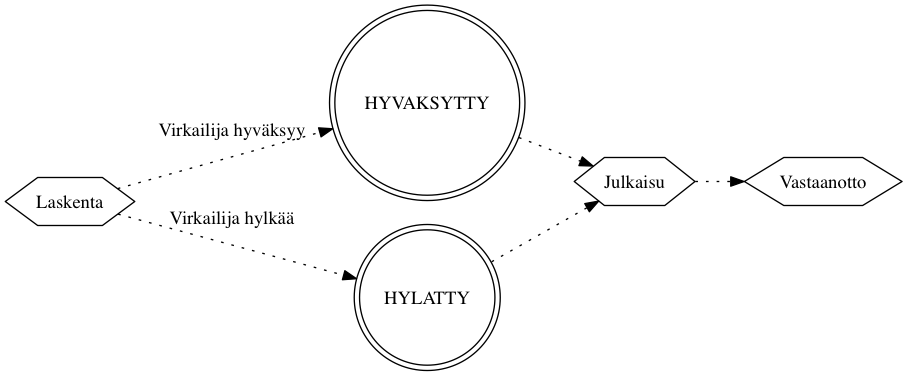
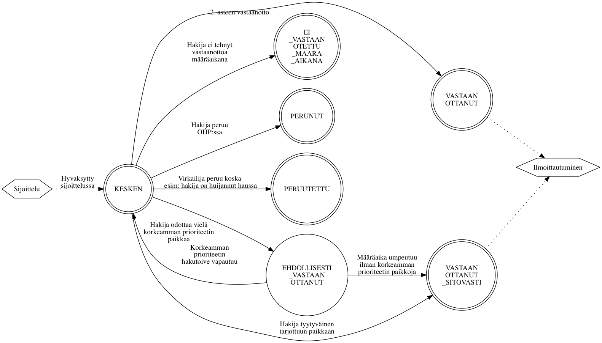

*Tämä dokumentti on koostettu kehityksen avuksi. Tämä dokumentti ei ole
virallinen vaatimusmäärittely.*

# Valintaprosessi ja hakemuksen ja vastaanoton tilasiirtymät

*Haku* sisältää *hakukohteita*. Kun *hakija* hakee hakukohteisiin, hän asettaa *hakemuksessa* listan
*hakutoiveita*. Valintaprosessi käy haun hakemukset läpi, kerää hakutoiveet ja etenee *valintalaskennan*
ja *sijoittelun* läpi. Prosessi voi edetä haun ja hakukohteen(???) asetuksista
riippuen automaattisesti tai virkailijan manuaalisesti edistämänä.

Hakutoiveen etenemistä valintaprosessissa kuvataan joukolla
tiloja. Tilojen väliset tilasiirtymät voivat tapahtua joko automaattisesti järjestelmän tekemänä
tai virkailijan tai opiskelijan toimesta, riippuen siitä haun asetuksista ja
mikä tilasiirtymä on kysessä.

Yhteishaku:

- Varsinainen haku: automaattinen laskenta ja sijoittelu
- Lisähaku: virkailija hallinnoi lisähaun valinnan vaiheita manuaalisesti

Erillishaku:

- ???

## Valintakoelaskenta

Kutsutaan hakijan ylimpään hakutoiveeseen tai kaavan mukaan esim. äidinkielen
mukaan kielikokeeseen.

### Välisijoittelu

Käytetään jos kaikkia hakijoita ei kutsuta valintakokeeseen vaan osa
hakijoista kutsutaan kokeeseen siihen hakukohteeseen johon kaavan mukaiset
pisteet riittävät.

## Valintalaskennan tila

Jos haussa käytetään sijoittelua, suoritetaan hakijoiden kesken *valintalaskenta*.
Laskenta valitsee ne hakijat (hakijoiden hakutoiveet) jatkoon jotka ylittävät
kyseisen hakukohteen asettamat vaatimukset, esimerkiksi pääsykoepisteiden
alarajan.

- `HYVAKSYTTAVISSA`: Hakutoive pääsee automatisoidusti jatkoon hakukohteelle
  määritellyn laskentakaavan pohjalta
- `HYLATTY`: Hakijan lähtotiedot eivät riittäneet jatkoon
- `MAARITTELEMATON`: Tila estää sijoitteluun etenemisen, ei voi syntyä
  laskennassa, oletusarvo ilman laskentaa tehtävässä haussa
- `VIRHE`: Laskentaa käytettäessä kun syötetiedoissa virhe
- `HYVAKSYTTY_HARKINNANVARAISESTI`: Virkailija päästää poikkeustapauksessa
  hakutoiveen manuaalisesti jatkoon

## Valinnan tila

Synonyymit: valintatila, hakemuksen tila, sijoittelun tila, hyväksymisen tila

Jos *haku* käyttää sijoittelua, *valintatila* päivittyy automaattisesti sitä
mukaa kun *hyväksytyt* hakijat päättävät vastaanotosta (katso "Valintatuloksen
tila"). Vapautuvia paikkoja annetaan *varalla* oleville henkilöille sitä mukaa
kun ensisijaisesti valituksi tulleet opiskelijat tekevät päätöksensä
*vastaanotosta*. Hakija voi tehdä vastaanoton vasta kun virkailija on
*julkaissut* tiedon valintatilasta. Jos haku ei käytä sijoittelua, virkailijat
asettavat hyväksymistiedon käsin.

- `HYVAKSYTTY`: Mahtunut hakukohteen asettamaan kiintiöön ja hakija voi tehdä
  vastaanottopäätöksen
- `HARKINNANVARAISESTI_HYVAKSYTTY`: Siirretty virkailijan toimesta
  hyväksytyksi ja hakija voi tehdä vastaanottopäätöksen. Käytössä vain 2.
  asteen haussa.
- `VARASIJALTA_HYVAKSYTTY`: Nostettu varasijalta hyväksytyksi kun paikkoja on
  vapautunut
- `VARALLA`: Odottaa muiden hakijoiden perumisista vapautuvia paikkoja
- `HYLATTY`: Hakutoive on hylätty virkailijan toimesta eikä hakija ei voi
  tulla valituksi kohteeseen
- `PERUNUT`: Hakija peruu itse tai ilmoittaa että ei ota paikkaa vastaan. Jos
  vastaanottoa ei suoriteta määräaikana valinta menee tähän tilaan. Estää
  sijoittelun tekemästä tilamuutoksia.
- `PERUUTETTU`: Oppilaitos peruu (hylkää) jo hyväksytyn paikan. Estää
  sijoittelun tekemästä tilamuutoksia.
- `PERUUNTUNUT`: Hakijan korkeamman prioriteetin hakutoive on mennyt
  `HYVAKSYTTY` tilaan jolloin tämä hakutoive peruuntuu

### Valinta ilman sijoittelua

### Valinta sijoittelun kanssa

## Vastaanoton tila

Synonyymit: vastaanotto, valintatuloksen tila, vastaanottotieto

Kun hakijan *valintatila* on määäritetty virkailijan tai sijoittelun toimesta,
virkailija *julkaisee* tiedon hakijalle. Tällöin valintatila ilmestyy
hakijalle OHP:hen, edelleen mahdollistaen paikan vastaanottotiedon asettamisen
siinä tapauksessa että hakutoive on hyväksytty.

Kielteisen valintatilan seurauksena vastaanottotieto on saatettu jo asettaa
valmiiksi, muutoin vastaanottotieto asetetaan hakijan ilmoituksen mukaan joko
virkailijan tai hakijan itsensä toimesta.

- Tilat joita käytetään hakutyypistä riippumatta
  - `KESKEN`: Odottaa hakijan vastaanottopäätöstä
  - `EI_VASTAANOTETTU_MAARA_AIKANA`: Hakija ei ilmoittanut
    vastaanottopäätöstään määräaikaan mennessä
  - `PERUNUT`: Hakija itse peruu vastaanoton OHP:n kautta
  - `PERUUTETTU`: Virkailija on perunut vastaanoton hakijan puolesta

- Vain toisen asteen hauissa käytettävät tilat
  - `VASTAANOTTANUT`: Hakija ilmoittaa vastaanoton 2. asteen haussa

- Vain korkeakouluhauissa käytettävät tilat
  - `EHDOLLISESTI_VASTAANOTTANUT`: KK-hakija vastaanottaa paikan jos
    korkeamman prioriteetin hakutoivetta vastaava paikka ei vapaudu
    määräaikaan mennessä
  - `VASTAANOTTANUT_SITOVASTI`: KK-hakija sitoutuu paikan vastaanottoon ja
    hylkää muut hakutoiveensa

- Tilat joita ei käytetä enää nykyisissä tai tulevissa hauissa
  - `ILMOITETTU`: Ei käytetä enää, vanhoissa ennen 2014 2. asteen haussa
    vastasi julkaistavuustietoa
  - `VASTAANOTTANUT_LASNA`: Ei käytetä enää, vanhoissa ennen 2014 2. asteen
    haussa vastasi julkaistavuustietoa
  - `VASTAANOTTANUT_POISSAOLEVA`: Ei käytetä enää, vanhoissa ennen 2014 2.
    asteen haussa vastasi julkaistavuustietoa

## Ilmoittautumisen tila

Synonyymit: ilmoittautuminen, ilmoittautumistila, ilmoittautumistieto

Jos opiskelija on vastaanottanut paikan johon hänet on hyväksytty, ilmoittaa
hän viimeiseksi läsnäolotietonsa. Kaikki ilmoittautumistilat ovat käytössä
sekä 2. asteen että korkeakoulujen hauissa. Soveltuvat tilat riippuvat
koulutuksen alkamiskaudesta. Käyttöliittymät eivät toistaiseksi välttämättä
huomioi kautta.

- `EI_TEHTY`: Alkutila
- `LASNA_KOKO_LUKUVUOSI`: vain kevään haussa
- `POISSA_KOKO_LUKUVUOSI`: vain kevään haussa
- `EI_ILMOITTAUTUNUT`: Virkailija tallentaa tilan jos hakija ei tehnyt
  ilmoittautumista määräaikaan mennessä
- `LASNA_SYKSY`: Läsnä syksyn, poissa kevät
- `POISSA_SYKSY`: Poissa syksyn, läsnä kevät
- `LASNA`: Läsnä, keväällä alkava koulutus - vain syksyn haussa
- `POISSA`: Poissa, keväällä alkava koulutus - vain syksyn haussa

# Synonyymit

| Virallinen nimi       | Käyttöliittymä                                                    | Koodi | Tietokanta |
| --------------------- | ----------------------------------------------------------------- | ----- | ---------- |
| Valintalaskennan tila |                                                                   |       |
| Valinnan tila         | valintatila, hakemuksen tila, sijoittelun tila, hyväksymisen tila |       | Hakukohde.valintatapajonot.hakemukset.tila
| Vastaanoton tila      | vastaanotto, valintatuloksen tila, vastaanottotieto               |       | Valintatulos.tila
| Ilmoittautumisen tila | ilmoittautuminen, ilmoittautumistila, ilmoittautumistieto         |       | Valintatulos.ilmoittautumisTila

# Dokumentaation kehitys

## Kaavioiden luonti

Kaaviot kuvataan tekstimuotoisissa `.dot` tiedostoissa. Ne muunnetaan kuviksi
[Graphviz työkalulla](http://www.graphviz.org/). Kaikki `.dot` tiedostot voi
muuntaa kuviksi ajamalla oheinen `./render-graphs.sh` komento.
