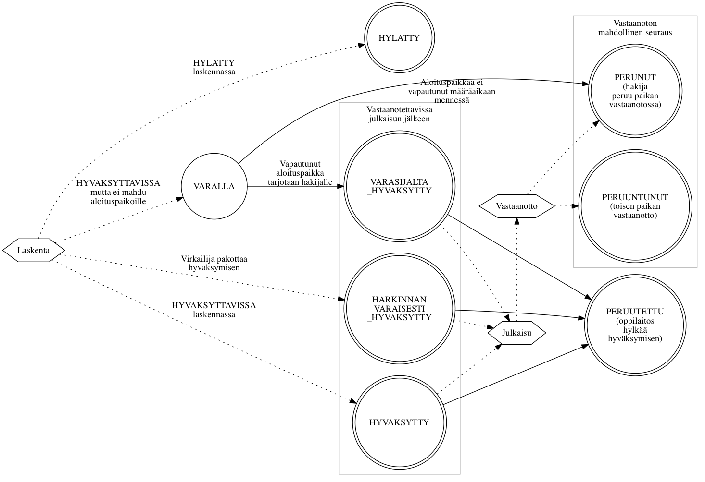

*Tämä dokumentti on koostettu kehityksen avuksi. Tämä dokumentti ei ole
virallinen vaatimusmäärittely.*

# Valintaprosessi ja hakemuksen ja vastaanoton tilasiirtymät

*Haku* sisältää *hakukohteita*. Kun *hakija* hakee hakukohteisiin, hän asettaa *hakemuksessa* listan
*hakutoiveita*. Valintaprosessi käy haun hakemukset läpi, kerää hakijoiden hakutoiveet ja etenee *valintalaskennan*
ja [*sijoittelun*](#sijoittelu) läpi. Hakukohteilla on määritetty *valintatapajonot* joiden *valintaperusteet* määrittävät säännöt
joilla hakijat kerätään valintatapajonoihin.

Valintatapajonolle määritetään käytetäänkö valintatapajonossa
laskentaa (tai manuaalinen import) ja siirretäänkö jono mukaan sijoitteluun. Valintatapajonolle määritetään *aloituspaikkojen* määrä.

Valintaprosessi voi edetä haun ja hakukohteen ja hakukohteen valintatapajonon asetuksista
riippuen automaattisesti tai virkailijan manuaalisesti edistämänä. Hakutoiveen etenemistä kuvataan joukolla tiloja.
Tilojen väliset tilasiirtymät voivat tapahtua joko automaattisesti järjestelmän
tekemänä tai virkailijan tai opiskelijan toimesta, riippuen siitä haun
asetuksista ja mikä tilasiirtymä on kysessä.

Yhteishaku:
- Varsinainen haku: automaattinen valintalaskenta ja sijoittelu. Automaattisen valintalaskennan sijaan virkailija voi
  myös tuoda hylätyt ja hyväksyttävissä olevat hakijat paremmuusjärjestyksessä excelillä tai json-rajapinnalla.
- Lisähaku: virkailija hallinnoi lisähaun valinnan vaiheita manuaalisesti

Erillishaku:
- voi olla kuten yhteishaun varsinainen haku
- voi olla ilman sijoittelua, jolloin laskennan yhteydessä hakijat sijoitellaan yhden hakukukohteen sisällä paremmuusjärjestykseen
- voi olla ilman valintalaskentaa ja ilman sijoittelua, virkailija tuo excelillä tai käyttöliittymässä hakijoiden valinnan tilat
- virkailija voi tuoda myös hakijoiden hakemukset jos haku on ollut muualla kuin opintopolussa

## Sanasto

- <a name="julkaisu">**Julkaisu**</a>: Virkailija merkitsee valinnan tuloksen
  hakijan nähtäväksi. Hakija voi tämän jälkeen tehdä päätöksen vastaanotosta
  jos hänet on [hyväksytty](#hyvaksytty).
- <a name="valintalaskenta">**Valintalaskenta**</a>: Valintaprosessin vaihe jossa
  hakijan hakemuksessa antamista tai kokeesta tulleista pisteistä tuotetaan
  lista hajioiden keskenäisestä järjestyksestä. Laskentaa varten on luotu
  laskentakaava joka määrittää lähtötiedoista lopullisen järjestyksen.
- <a name="kausi">**Kausi**</a>: Koulutuksen alkamisajankohta, kevät tai syksy.
- <a name="sijoittelu">**Sijoittelu**</a>: Hakukohtainen toistettava vaihe jossa
  [valintalaskennan](#valintalaskenta) tulosten mukaan hakijat on ryhmitelty
  [*hyväksytyksi*](#hyvaksytty) tai kiintiöön mahtumattomana *varalle*
  (poikkeustapauksissa *hylätyksi*). *Hyväksyttyjen* hakijoiden
  [vastaanottopäätösten](#vastaanoton-tila) perusteella sijoittelu voi nostaa
  *varalla* olleita hakemuksia *hyväksytyiksi*. Sijoittelua suoritetaan niin
  kauan kun hakijat voivat muuttaa *vastaanoton tilaa*.
- <a name="hakutoive">**Hakutoive**</a>: Hakijan hakemukselle syöttämä
  opiskelupaikka johon hän haluaa tulla [hyväksytyksi
  valinnassa](#valinnan-tila). Hausta riippuen hakutoiveiden keskinäisellä
  järjestyksellä voi olla merkitystä.
- <a name="ohp">**OHP**</a>: Oppijan Henkilökohtainen Palvelu, tai "omat sivut", on
  hakijoiden käyttöliittymä josta voi muokata lähettämiään hakemuksia ja
  hallita omia [hakutoiveita](#hakutoive). Kun haun [valinnan
  tila](#valinnan-tila) on [julkaistu](#julkaisu) virkailijoiden toimesta,
  hakija voi hyväksytyssä tapauksessa tehdä päätöksen hakutoiveensa
  [vastaanotosta](#vastaanoton-tila) ja [ilmoittaa
  läsnäolonsa](#ilmoittautumisen-tila) palvelun kautta.

## Valintakoelaskenta

Kutsutaan hakijan samaa koetta käyttävistä hakutoiveista ylimpään hakutoiveeseen tai kaavan mukaan esim. äidinkielen
mukaan kielikokeeseen.

### Välisijoittelu

Käytetään jos kaikkia hakijoita ei kutsuta valintakokeeseen vaan osa
hakijoista kutsutaan kokeeseen siihen hakukohteeseen johon kaavan mukaiset
pisteet riittävät.

## Valintalaskennan tila

Jos haussa käytetään [sijoittelua](#sijoittelu), suoritetaan hakijoiden kesken
[valintalaskenta](#valintalaskenta). Laskenta valitsee ne hakijat (hakijoiden
hakutoiveet) jatkoon jotka ylittävät kyseisen hakukohteen asettamat
vaatimukset, esimerkiksi pääsykoepisteiden alarajan.

- `HYVAKSYTTAVISSA`: Hakutoive pääsee automatisoidusti jatkoon hakukohteelle
  määritellyn laskentakaavan pohjalta
- `HYLATTY`: Hakijan lähtotiedot eivät riittäneet jatkoon
- `MAARITTELEMATON`: Tila estää sijoitteluun etenemisen, ei voi syntyä
  laskennassa, oletusarvo ilman laskentaa tehtävässä haussa
- `VIRHE`: Laskentaa käytettäessä kun syötetiedoissa virhe
- `HYVAKSYTTY_HARKINNANVARAISESTI`: Virkailija päästää poikkeustapauksessa
  hakutoiveen manuaalisesti jatkoon

## Valinnan tila

Synonyymit: valintatila, hakemuksen tila, sijoittelun tila, hyväksymisen tila

Jos *haku* käyttää [sijoittelua](#sijoittelu), *valinnan tila* päivittyy seuraavalla
sijoittelukerralla sitä mukaa kun *hyväksytyt* hakijat päättävät
[vastaanotosta](#vastaanoton-tila). Sijoittelu suoritetaan yleensä vähintään
kerran päivässä niin kauan kun hakijat voivat tehdä vastaanottopäätöksiä.
Ensisijaisesti valituksi tulleiden opiskelijoiden vastaanottopäätösten
seurauksena vapautuvia paikkoja annetaan *varalla* oleville hakijoille.
Hakija voi tehdä vastaanoton vasta kun virkailija on [julkaissut](#julkaisu)
tiedon valinnan tilasta. Jos haku ei käytä sijoittelua, virkailijat asettavat
hyväksymistiedon käsin.

- `VARALLA`: Odottaa muiden hakijoiden perumisista vapautuvia paikkoja
- `HYLATTY`: Hakutoive on hylätty virkailijan toimesta eikä hakija ei voi
  tulla valituksi kohteeseen
- <a name-"hyvaksytty">Hyväksytyt</a> tilat mahdollistavat hakijan
  [vastaanottaa](#vastaanoton-tila) tarjottu *paikka*.
  - `HYVAKSYTTY`: Mahtunut hakukohteen asettamaan kiintiöön ja hakija voi tehdä
    vastaanottopäätöksen
  - `HARKINNANVARAISESTI_HYVAKSYTTY`: Siirretty virkailijan toimesta
    hyväksytyksi ja hakija voi tehdä vastaanottopäätöksen. Käytössä vain 2.
    asteen haussa.
  - `VARASIJALTA_HYVAKSYTTY`: Nostettu varasijalta hyväksytyksi kun paikkoja on
    vapautunut
- <a name="peruttu">Perutut</a> tilat syntyvät jos [hyväksyttyä](#hyvaksytty)
  paikkaa jää [vastaanottamatta](#vastaanoton-tila).
  - `PERUNUT`: Hakija peruu itse tai ilmoittaa että ei ota paikkaa vastaan. Jos
    vastaanottoa ei suoriteta määräaikana valinta menee tähän tilaan. Estää
    sijoittelun tekemästä tilamuutoksia.
  - `PERUUTETTU`: Oppilaitos peruu (hylkää) jo hyväksytyn paikan. Estää
    sijoittelun tekemästä tilamuutoksia.
  - `PERUUNTUNUT`: Hakijan korkeamman prioriteetin hakutoive on mennyt
    `HYVAKSYTTY` tilaan jolloin tämä hakutoive peruuntuu

### Valinta ilman sijoittelua

### Valinta sijoittelun kanssa

## Vastaanoton tila

Synonyymit: vastaanotto, valintatuloksen tila, vastaanottotieto

Kun hakijan [valinnan tila](#valinnan-tila) on määäritetty virkailijan tai
[sijoittelun](#sijoittelu) toimesta, virkailija [julkaisee](#julkaisu) tiedon hakijalle.
Tällöin [valinnan tila](#valinnan-tila) ilmestyy hakijalle [OHP:hen](#ohp),
edelleen mahdollistaen paikan *vastaanoton tilan* asettamisen siinä
tapauksessa että hakutoive on hyväksytty.

Kielteisen valinnan tilan seurauksena *vastaanoton tila* on saatettu jo
asettaa valmiiksi, muutoin *vastaanoton tila* asetetaan hakijan ilmoituksen
mukaan joko virkailijan tai hakijan itsensä toimesta.

- Tilat joita käytetään hakutyypistä riippumatta
  - `KESKEN`: Odottaa hakijan vastaanottopäätöstä
  - `EI_VASTAANOTETTU_MAARA_AIKANA`: Hakija ei ilmoittanut
    vastaanottopäätöstään määräaikaan mennessä
  - `PERUNUT`: Hakija itse peruu vastaanoton OHP:n kautta
  - `PERUUTETTU`: Virkailija on perunut vastaanoton hakijan puolesta

- Vain toisen asteen hauissa käytettävät tilat
  - `VASTAANOTTANUT`: Hakija ilmoittaa vastaanoton 2. asteen haussa

- Vain korkeakouluhauissa käytettävät tilat
  - `EHDOLLISESTI_VASTAANOTTANUT`: KK-hakija vastaanottaa paikan jos
    korkeamman prioriteetin hakutoivetta vastaava paikka ei vapaudu
    määräaikaan mennessä
  - `VASTAANOTTANUT_SITOVASTI`: KK-hakija sitoutuu paikan vastaanottoon ja
    hylkää muut hakutoiveensa

- Tilat joita ei käytetä enää nykyisissä tai tulevissa hauissa
  - `ILMOITETTU`: Ei käytetä enää, vanhoissa ennen 2014 2. asteen haussa
    vastasi julkaistavuustietoa
  - `VASTAANOTTANUT_LASNA`: Ei käytetä enää, vanhoissa ennen 2014 2. asteen
    haussa vastasi julkaistavuustietoa
  - `VASTAANOTTANUT_POISSAOLEVA`: Ei käytetä enää, vanhoissa ennen 2014 2.
    asteen haussa vastasi julkaistavuustietoa

## Ilmoittautumisen tila

Synonyymit: ilmoittautuminen, ilmoittautumistila, ilmoittautumistieto

Jos opiskelija on [vastaanottanut](#vastaanoton-tila) paikan johon hänet on
[hyväksytty](#hyvaksytty), ilmoittaa
hän viimeiseksi läsnäolotietonsa. Kaikki ilmoittautumistilat ovat käytössä
sekä 2. asteen että korkeakoulujen hauissa. Soveltuvat tilat riippuvat
koulutuksen [alkamiskaudesta](#kausi). Käyttöliittymät eivät toistaiseksi
välttämättä huomioi kautta.

- `EI_TEHTY`: Alkutila
- `LASNA_KOKO_LUKUVUOSI`: vain kevään haussa
- `POISSA_KOKO_LUKUVUOSI`: vain kevään haussa
- `EI_ILMOITTAUTUNUT`: Virkailija tallentaa tilan jos hakija ei tehnyt
  ilmoittautumista määräaikaan mennessä
- `LASNA_SYKSY`: Läsnä syksyn, poissa kevät
- `POISSA_SYKSY`: Poissa syksyn, läsnä kevät
- `LASNA`: Läsnä, keväällä alkava koulutus - vain syksyn haussa
- `POISSA`: Poissa, keväällä alkava koulutus - vain syksyn haussa

# Koodaajan synonyymit

| Virallinen nimi       | Käyttöliittymä                                                    | Koodi | Tietokanta |
| --------------------- | ----------------------------------------------------------------- | ----- | ---------- |
| Valintalaskennan tila |                                                                   | JarjestyskriteerituloksenTila       |
| Valinnan tila         | valintatila, hakemuksen tila, sijoittelun tila, hyväksymisen tila | HakutoiveenValintatapajonoDTO.tila | Hakukohde.valintatapajonot.hakemukset.tila
| Vastaanoton tila      | vastaanotto, valintatuloksen tila, vastaanottotieto               | Valintatulos.tila | Valintatulos.tila
| Ilmoittautumisen tila | ilmoittautuminen, ilmoittautumistila, ilmoittautumistieto         | Valintatulos.ilmoittautumisTila | Valintatulos.ilmoittautumisTila

# Dokumentaation kehitys

## Kaavioiden luonti

Kaaviot kuvataan tekstimuotoisissa `.dot` tiedostoissa. Ne muunnetaan kuviksi
[Graphviz työkalulla](http://www.graphviz.org/). Kaikki `.dot` tiedostot voi
muuntaa kuviksi ajamalla oheinen `./render-graphs.sh` komento.
