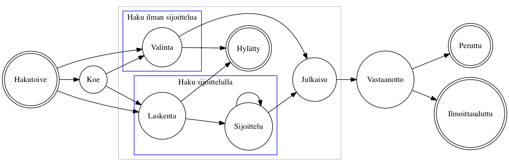

# Hakemuksen ja vastaanoton tilasiirtymät

Hakemuksen luonnin ja opiskelupaikkaan ilmoittautumisen sisältyy kolme eri
vaihetta: *valinta*, *vastaanotto* ja *ilmoittautuminen*. Kussakin vaiheessa
prosessin kokonaistilaa kuvaa joukko vaiheiden tiloja. Tilasiirtymät voivat
tapahtua joko automaattisesti tai virkailijan tai opiskelijan toimesta. Tilat
ja siirtymuat on koitettu kuvata alla tilakoneina.

*Tämä dokumentti on koostettu kehityksen avuksi. Tämä dokumentti ei ole
virallinen vaatimusmäärittely.*

## Laskennan tulos

Tila joka mahdollistaa hakutoiveen siirtymisen sijoitteluun.

- `HYVAKSYTTAVISSA`
- `HYLATTY`
- `MAARITTELEMATON`
- `HYVAKSYTTY_HARKINNANVARAISESTI`

## Valintatila / sijoittelun tila

Synonyymit: valintatila, hakemuksen tila, sijoittelun tila, hyväksymisen tila

- `HYVAKSYTTY`: Hakija voi ottaa paikan vastaan
- `HARKINNANVARAISESTI_HYVAKSYTTY`: Hakutoive on siirretty virkailijan toimesta manuaalisesti eteenpäin
- `VARASIJALTA_HYVAKSYTTY`: Hakija voi ottaa paikan vastaan (alunperin varasijalla)
- `VARALLA`: Hakija voi tulla kohteeseen valituksi (jossain vaiheessa)
- `HYLATTY`: Hakija ei voi koskaan tulla valituksi kohteeseen
- `PERUNUT`: Hakija ei ole vastaanottanut paikkaa. Hakija ei voi tulla enää valituksi matalamman prioriteetin kohteissa
- `PERUUTETTU`: Virkailija on perunut paikan. Sama toiminnallisuuks kuil HYLATTY
- `PERUUNTUNUT`: Hakija on tullut valituksi parempaan paikkaan (korkeampi hakutoive)
- `KESKEN`: ??? onko mahdollinen

## Valintatuloksen tila

Synonyymit: vastaanotto, valintatuloksen tila, vastaanottotieto

- `ILMOITETTU`
- `VASTAANOTTANUT`
- `VASTAANOTTANUT_LASNA`
- `VASTAANOTTANUT_POISSAOLEVA`
- `EI_VASTAANOTETTU_MAARA_AIKANA`
- `PERUNUT`
- `PERUUTETTU`
- `EHDOLLISESTI_VASTAANOTTANUT`
- `VASTAANOTTANUT_SITOVASTI`
- `KESKEN`

## Ilmoittautumisen tila (läsnäoloilmoitus)

Synonyymit: ilmoittautuminen, ilmoittautumistila, ilmoittautumistieto

Jos opiskelija on vastaanottanut paikan johon hänet on hyväksytty, ilmoittaa
hän viimeiseksi läsnäolotietonsa.

- `EI_TEHTY`
- `LASNA_KOKO_LUKUVUOSI`
- `POISSA_KOKO_LUKUVUOSI`
- `EI_ILMOITTAUTUNUT`
- `LASNA_SYKSY`: Läsnä syksy, poissa kevät
- `POISSA_SYKSY`: Poissa syksy, läsnä kevät
- `LASNA`: Läsnä, keväällä alkava koulutus
- `POISSA`: Poissa, keväällä alkava koulutus

# Hakujen tilasiirtymät

## Kaavioiden päivitys

Kaaviot kuvataan tekstimuotoisissa `.dot` tiedostoissa. Ne käännetään kuviksi
[Graphviz työkalulla](http://www.graphviz.org/). Kaikki `.dot` tiedostot voi
kääntää ajamalla oheinen `./mk.sh` komento.

## Vastaanotto

## Lisähaku

## Erillishaku

