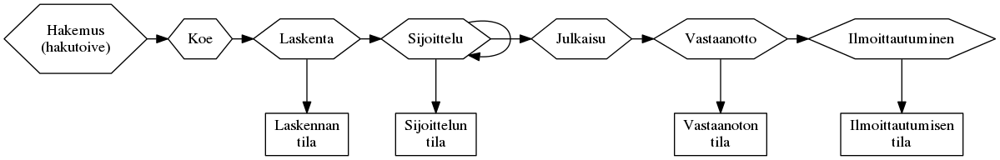
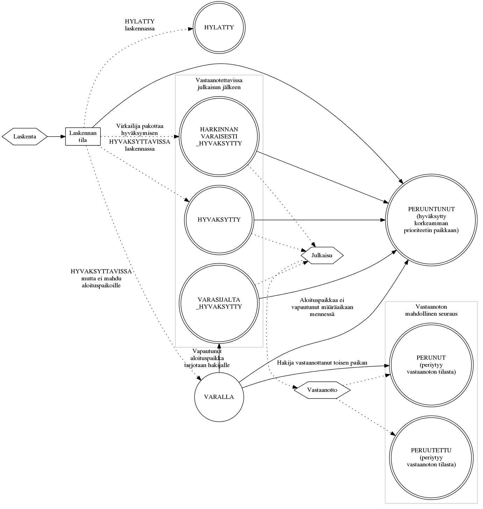

*Tämä dokumentti on koostettu kehityksen avuksi. Tämä dokumentti ei ole
virallinen vaatimusmäärittely.*

# Valintaprosessi

*Haku* sisältää [*hakukohteita*](#hakukohde). Kun *hakija* hakee
hakukohteisiin, hän antaa [*hakemuksessa*](#hakemus) listan
[*hakutoiveita*](#hakutoive). [*Laskenta*](#laskenta) käy haun hakemukset läpi ja kerää
hakijoiden hakutoiveet. [*sijoittelu*](#sijoittelu) järjestää hakijat paremmuusjärjestykseen josta valitaan *hyväksytyt*
hakijat joille tarjotaan opiskelupaikkaa. Kun hakijat vastaanottavat tai peruvat *opiskelupaikkoja*, sijoittelussa voi vapautua
*opiskelupaikkoja* muille hakijoille.

Hakukohteille määritetään [*valinnan vaiheita*](#valinnan-vaihe).
Valinnanvaihe määrittää hakukohteelle [*valintatapajonoja*](#valintatapajono). Valintatapajonoille määritetään
laskentakaavoja. *Valintatapajonon* asetuksista kuten mm. varasijakäsittelysäännöt ja laskentakaavat käytetään nimitystä *valintaperusteet*.

Valintatapajonoilla laskentakaavat pisteyttävät ja järjestävät hakijat ja erottelevat hyväksyttävissä olevat ja hylätyt hakijat.
Osa valintatapajonoista siirretään sijoitteluun ja valintatapajonon *aloituspaikkojen* määrä määrittää kuinka moni hyväksytään. Valintatapajonoja
voi käyttää myös ilman sijoitteluun siirtämistä esim. hakijalistojen muodostamiseen tai niissä hauissa missä ei ole sijoittelua käytössä.

Valintatapajonolle ja hakukohteelle voi määrittää hakijaryhmiä. Hakijaryhmän laskentakaava ja kiintiö määrittävät joukon hakijoita
jotka joko priorisoidaan aloituspaikoille tai suljetaan ulkopuolelle.

Valintaprosessi etenee haun ja hakukohteen ja hakukohteen valintavaiheiden valintatapajonojen
asetuksista riippuen automaattisesti tai [*virkailijan*](#virkailija) manuaalisesti
edistämänä.

Alla oleva kuva näyttää valintaprosessin vaiheiden keskinäisen
järjestyksen sekä hakutoiveiden käsittelyyn liittyvät tilat.

## Esimerkkejä

- Hakukohde: Aalto-yliopisto, Kauppakorkeakoulu Mikkelin kampus, Kauppatieteiden kandidaatti (BScBA), Mikkeli ja kauppatieteiden maisteri
  - Vaiheet:
    - Hakukelpoisuuden käsittelyvaihe
    - Varsinainen valinta
      - Valintatapajonot:
        - Valintaryhmä I, aloituspaikat 45
        - Valintaryhmä II, aloituspaikat 13
        - Valintaryhmä III, aloituspaikat 25
- Aloituspaikkoja yhteensä: 83 jotka valitaan kolmen jonon kautta

## Hakutyypit

Valintaprosessissa käytettävät vaiheet ja niiden käytännöt vaihtelevat hausta
toiseen. Tässä on kuvattu erilaisia käytännön hakutyyppejä ja niiden
käyttötilanteita.

### Yhteishaku

Yhteishaku tarkoittaa *korkeakoulujen yhteishakua* tai *2. asteen yhteishakua*
ammatillisiin- ja lukiokoulutuksiin. Yhteishaussa on tarjolla suuri määrä
[hakukohteita](#hakukohde) joista hakija voi valita haussa määritellyn määrän
[hakutoiveita](#hakutoive) samalla [hakemuksella](#hakemus).

- **Varsinainen haku**: Haussa käytetään automaattista laskentaa ja sijoittelua.
  Automaattisen laskennan sijaan virkailija voi myös tuoda *hylätyt* ja
  *hyväksyttävissä* olevat hakijat paremmuusjärjestyksessä excelillä tai
  JSON-rajapinnalla.
- **Lisähaku**: Koulut voivat tarjota varsinaisen haun jälkeen vajaiksi jääneitä hakukohteita lisähaussa.
  Lisähaussa virkailija hallinnoi valinnan vaiheita manuaalisesti. Lisähaussa ei käytetä sijoittelua.

### Erillishaku

Erillishaussa tarjotaan hakukohteita joihin ei haeta yhteishaussa. Oppilaitokset
voivat järjestää erillishakuja haluaminaan ajankohtina. Erillishausta riippuen hakemuksissa voi olla yksi tai useampi
hakukohde. Hakutoiveiden priorisointi voi olla käytössä tai ei.

- Voi olla automaattisella sijoittelulla ja laskennalla kuten yhteishaun varsinainen haku
- Voi olla ilman sijoittelua, jolloin laskennan yhteydessä hakijat
  sijoitellaan yhden hakukukohteen sisällä paremmuusjärjestykseen
- Voi olla ilman laskentaa ja ilman sijoittelua, virkailija tuo
  excelillä tai käyttöliittymässä hakijoiden *sijoittelun tilat*
- Virkailija voi tuoda myös hakijoiden hakemukset jos haku on ollut muualla
  kuin *opintopolussa*

## Sanasto

- <a name="virkailija">**Virkailija**</a>: Hakua tai hakukohdetta ylläpitävä henkilö.
- <a name="hakemus">**Hakemus**</a>: Hakijan hakuun lähettämät taustatiedot ja
  [hakutoiveet](#hakutoive). Hakemuksen sisältö ja hakutoiveiden mahdollinen
  määrä riippuu hausta.
- <a name="hakukohde">**Hakukohde**</a>: Oppilaitoksen haussa tarjoama
  koulutus johon hakijat kohdistavat hakemuksessaan
  [hakutoiveita](#hakutoive).
- <a name="julkaisu">**Julkaisu**</a>: Virkailija merkitsee [sijoittelun
  tilan](#sijoittelun-tila) lopulliseksi jolloin sijoittelun tila tulee hakijan nähtäväksi
  [OHP:ssa](#ohp) kyseiselle [hakutoiveelle](#hakutoive) ja hakija voi mahdollisesti vastaanottaa paikan. Hakija voi tämän
  jälkeen tehdä päätöksen vastaanotosta jos hänelle tarjoutuu [paikka](#opiskelupaikka).
- <a name="laskenta">**Laskenta**</a>: Valintaprosessin vaihe jossa
  hakijan hakemuksessa antamista tai kokeesta tulleista pisteistä tuotetaan
  lista hakijioiden keskenäisestä järjestyksestä. Laskentaa varten on luotu
  laskentakaava joka määrittää lähtötiedoista lopullisen järjestyksen.
- <a name="hakukausi">**Hakukausi**</a>: Hakukausi voi olla kevät tai syksy. Hakukausi voi olla sama tai edeltää koulutuksen alkamiskautta
- <a name="sijoittelu">**Sijoittelu**</a>: Hakukohtainen toistettava vaihe jossa
  [laskennan](#laskenta) tulosten mukaan hakijat on ryhmitelty
  [*hyväksytyksi*](#hyvaksytty) tai *aloituspaikkoihin* mahtumattomana *varalle* tai laskennasta periytyneenä hylätyksi.
  Sijoittelu voi myös muuttaa hakijoita peruuntuneiksi tai peruneiksi.
  Hyväksyttyjen hakijoiden
  [vastaanottopäätösten](#vastaanoton-tila) perusteella sijoittelu voi nostaa
  varalla olleita hakijoita hyväksytyiksi. Sijoittelua suoritetaan niin
  kauan kun hakijat voivat muuttaa *vastaanoton tilaa*.
- <a name="hakutoive">**Hakutoive**</a>: Hakijan hakemukselle syöttämä
  hakutoive johon hän haluaa tulla [hyväksytyksi
  valinnassa](#sijoittelun-tila). Hausta riippuen hakutoiveiden keskinäisellä
  järjestyksellä voi olla merkitystä.
- <a name="opiskelupaikka">**Opiskelupaikka**</a>: Hakijan toteutunut, eli [hyväksytty](#hyvaksytty),
  [hakutoive](#hakutoive) josta hakija tekee [vastaanottopäätöksen](#vastaanoton-tila).
- <a name="ohp">**OHP**</a>: Oppijan Henkilökohtainen Palvelu, tai "omat sivut", on
  hakijoiden käyttöliittymä josta voi muokata lähettämiään hakemuksia ja
  hallita omia [hakutoiveita](#hakutoive). Kun haun [sijoittelun
  tila](#sijoittelun-tila) on [julkaistu](#julkaisu) virkailijoiden toimesta,
  hakija voi [hyväksytyssä tapauksessa](#hyvaksytty) tehdä päätöksen hakutoiveensa
  [vastaanotosta](#vastaanoton-tila) ja [ilmoittaa
  läsnäolonsa](#ilmoittautumisen-tila) palvelun kautta.
- <a name="valinnan-vaihe">**Valinnan vaihe**</a>: Hakijoiden tiedoista,
  esimerkiksi koepisteistä, muodostetaan *laskentakaavalla* [laskennan
  tila](#laskennan-tila). Hyväksyttävien joukko voidaan tuottaa
  useammassa vaiheessa. Hakukohde voi esimerkiksi valita ensimmäisessä
  valinnan vaiheessa pääsykokeeseen ne, joiden tietty YO-arvosana on tarpeeksi
  korkea. Seuraavassa vaiheessa karsitaan kaikki pääsykokeesta alle X pistettä
  saaneet.
- <a name="valintatapajono">**Valintatapajono**</a>: Valintatapajonoon kerätään hakutoiveet [valinnan
  vaiheen](#valinnan-vaihe) pisteyttämään järjestykseen. Hakijat jotka eivät
  läpäisseet valinnan vaihetta, *hylätään*. Jos jonolla on aloituspaikkamäärä,
  rajan alle jäävät mutta valinnan vaiheen läpäisseet jäävät varalle.
  [Hakijaryhmä](#hakijaryhma) voi yliajaa jonojen järjestyksen.
- <a name="hakijaryhma">**Hakijaryhmä**</a>: Voi sisällyttää tai poissulkea
  hakijoita jonoista. Esimerkiksi jos hakukohteeseen halutaa vähintään 10
  lukiotaustaista henkilöä mutta vain 9 mahtuu paremmuusjärjestyksessä jonon
  aloituspaikkamäärän sisälle, nostetaan kymmenes hyväksytty lukiotaustainen
  henkilö viimeisen aloituspaikoille mahtuneen ei-lukiotaustaisen tilalle.

## Valintakoelaskenta

Kutsutaan hakijan samaa koetta käyttävistä hakutoiveista ylimpään
hakutoiveeseen tai kaavan mukaan esim. äidinkielen
mukaan kielikokeeseen.

### Välisijoittelu

Käytetään jos kaikkia hakijoita ei kutsuta valintakokeeseen vaan osa
hakijoista kutsutaan kokeeseen siihen hakukohteeseen johon kaavan mukaiset
pisteet riittävät.

# Valintaprosessin vaiheiden tilat

## Laskennan tila

Hakukohteen valinnan vaiheiden valintatapajonoissa pidetään yllä laskennan tilaa.
Hakukohteen kaikki hakijat laitetaan jokaiseen valintatapajonoon ja laskentakaavat
määrittävät ketkä hakijoista ovat jonokohtaisesti hyväksyttävissä [sijoitteluun](#sijoittelu).
Virkailija voi myös tuoda hakijakohtaiset laskennan tilat käsin.

- `HYVAKSYTTAVISSA`: Hakutoive pääsee automatisoidusti jatkoon hakukohteelle
  määritellyn *laskentakaavan* pohjalta ja sijoittelu voi päivittää hakijan tilan hyväksytyksi
- `HYLATTY`: Hakijan lähtotiedot eivät riittäneet jatkoon
- `MAARITTELEMATON`: Määrittelemätön-tilaiset hakijat eivät siirry sijoitteluun. Valintatapajonon voi siirtää sijoitteluun mutta sijoittelu ei huomioi em. hakijoita. Ei voi syntyä
  laskennassa, oletusarvo ilman laskentaa tehtävässä jonossa
- `VIRHE`: Laskenta asettaa tilan kun syötetiedoissa on virhe
- `HYVAKSYTTY_HARKINNANVARAISESTI`: Virkailija päästää poikkeustapauksessa
  hakutoiveen manuaalisesti jatkoon

## Sijoittelun tila

Synonyymit: valintatila, hakemuksen tila, sijoittelun tila, hyväksymisen tila

Automaattinen sijoitteluprosessi tarkkailee eri vaiheiden tilamuutoksia.
Jos laskentaa käytetään, [laskennan tila](#laskennan-tila) on pohjana sijoittelun tilalle.
Sijoittelun tilaan vaikuttaa myös [vastaanoton tilan](#vastaanoton-tila) muutos.

Jos haku käyttää [sijoittelua](#sijoittelu), *sijoittelun tila* päivittyy seuraavalla
*sijoittelukerralla* sitä mukaa kun hyväksytyt hakijat päättävät
[vastaanotosta](#vastaanoton-tila). Sijoittelu suoritetaan yleensä vähintään
kerran päivässä niin kauan kun hakijat voivat tehdä vastaanottopäätöksiä.
Hakija voi tehdä vastaanoton vasta kun virkailija on [julkaissut](#julkaisu)
tiedon sijoittelun tilasta. Vastaanoton seurauksena vapautuvia paikkoja annetaan *varalla* oleville hakijoille.

Jos haku ei käytä sijoittelua, virkailijat asettavat sijoittelun tilan käsin.

- `VARALLA`: Odottaa muiden hakijoiden [*perumisista*](#peruttu) vapautuvia paikkoja
- `HYLATTY`: Kopioitu laskennan `HYLATTY` tilasta
- <a name="hyvaksytty">Hyväksytyt</a> tilat mahdollistavat hakijan
  [vastaanottaa](#vastaanoton-tila) tarjottu [paikka](#opiskelupaikka).
  - `HYVAKSYTTY`: Mahtunut valintatapajonolle asetettuihin *aloituspaikkoihin* ja hakija
    voi tehdä vastaanottopäätöksen
  - `HARKINNANVARAISESTI_HYVAKSYTTY`: Siirretty virkailijan toimesta
    hyväksytyksi ja hakija voi tehdä vastaanottopäätöksen. Käytössä vain *2.
    asteen haussa*.
  - `VARASIJALTA_HYVAKSYTTY`: Nostettu `VARALLA`-tilasta hyväksytyksi kun paikkoja on
    vapautunut
- <a name="peruttu">Perutut</a> tilat syntyvät jos [hyväksytty](#hyvaksytty)
  paikkaa jää [vastaanottamatta](#vastaanoton-tila).
  - `PERUNUT`: Sijoittelu kopioi PERUNUT arvon [vastaanoton tilasta](#vastaanoton-tila). Estää
    sijoittelua tekemästä tilamuutoksia tähän hakutoiveeseen.
  - `PERUUTETTU`: Sijoittelu kopioi PERUUTETTU-arvon [vastaanoton tilasta](#vastaanoton-tila) jos se on sinne asetettu.
  - `PERUUNTUNUT`: Hakijan *korkeamman prioriteetin* hakutoive on mennyt
    `HYVAKSYTTY` tilaan jolloin tämä hakutoive peruuntuu. Tätä ei tapahdu
    jos hakija on [`VASTAANOTTANUT_SITOVASTI`](#sijoittelun-tila) tämän
    hakutoiveen. Muita tilanteita: hakukohteen varasijatäyttö on päättynyt tai siellä ole lainkaan varasijatäyttöä.

## Vastaanoton tila

Synonyymit: vastaanotto, valintatuloksen tila, vastaanottotieto

Kun hakijan [sijoittelun tila](#sijoittelun-tila) on määritetty virkailijan tai
[sijoittelun](#sijoittelu) toimesta, virkailija [julkaisee](#julkaisu) tiedon hakijalle.
Tällöin [sijoittelun tila](#sijoittelun-tila) ilmestyy hakijalle [OHP:uun](#ohp),
edelleen mahdollistaen *vastaanoton tilan* asettamisen siinä tapauksessa
että hakutoive on [hyväksytty](#hyvaksytty).

*vastaanoton tila* asetetaan hakijan ilmoituksen
mukaan joko virkailijan tai hakijan itsensä toimesta.
*Vastaanoton tila* voi muuttua myös sijoittelun tai vastaanoton seurauksena.

- Tilat joita käytetään hakutyypistä riippumatta
  - `KESKEN`: Odottaa hakijan vastaanottopäätöstä
  - `EI_VASTAANOTETTU_MAARA_AIKANA`: Hakija ei ilmoittanut
    vastaanottopäätöstään määräaikaan mennessä
  - `PERUNUT`: Hakija itse peruu vastaanoton OHP:n kautta. Jos vastaanottoa ei suoriteta *määräaikana* päädytään tähän tilaan.
  - `PERUUTETTU`: Oppilaitos peruu (hylkää) jo hyväksytyn paikan. Estää
   sijoittelua tekemästä tilamuutoksia, esim: hakija on huijannut haussa.

- Vain toisen asteen hauissa käytettävät tilat
  - `VASTAANOTTANUT`: Hakija ilmoittaa vastaanoton 2. asteen haussa

- Vain korkeakouluhauissa käytettävät tilat
  - `EHDOLLISESTI_VASTAANOTTANUT`: KK-hakija vastaanottaa paikan jos
    korkeamman prioriteetin hakutoivetta vastaava [paikka](#opiskelupaikka) ei vapaudu
    määräaikaan mennessä. Yhden paikan sääntö voimassa!
  - `VASTAANOTTANUT_SITOVASTI`: KK-hakija sitoutuu paikan vastaanottoon. Yhden paikan sääntö voimassa: muiden vastaanotettavissa olevien paikkojen vastaanoton tila asetetaan `PERUNUT` tilaan.

- Tilat joita ei käytetä enää nykyisissä tai tulevissa hauissa
  - `ILMOITETTU`: Ei käytetä enää, vanhoissa ennen 2014 olleissa 2. asteen haussa
    vastasi julkaistavuustietoa
  - `VASTAANOTTANUT_LASNA`: Ei käytetä enää, vanhoissa ennen 2014 olleissa 2. asteen
    haussa vastasi julkaistavuustietoa
  - `VASTAANOTTANUT_POISSAOLEVA`: Ei käytetä enää, vanhoissa ennen 2014 olleissa 2.
    asteen haussa vastasi julkaistavuustietoa

## Ilmoittautumisen tila

Synonyymit: ilmoittautuminen, ilmoittautumistila, ilmoittautumistieto

Jos hakija on [vastaanottanut](#vastaanoton-tila) paikan johon hänet on
[hyväksytty](#hyvaksytty), ilmoittaa
hän viimeiseksi *läsnäolotietonsa*. Kaikki ilmoittautumistilat ovat käytössä
sekä 2. asteen että korkeakoulujen hauissa. Soveltuvat tilat riippuvat
koulutuksen alkamiskaudesta.

- `EI_TEHTY`: Alkutila
- `LASNA_KOKO_LUKUVUOSI`: vain kevään haussa
- `POISSA_KOKO_LUKUVUOSI`: vain kevään haussa
- `EI_ILMOITTAUTUNUT`: Virkailija tallentaa tilan jos hakija ei tehnyt
  ilmoittautumista määräaikaan mennessä
- `LASNA_SYKSY`: Läsnä syksyn, poissa kevät
- `POISSA_SYKSY`: Poissa syksyn, läsnä kevät
- `LASNA`: Läsnä, keväällä alkava koulutus - vain syksyn haussa
- `POISSA`: Poissa, keväällä alkava koulutus - vain syksyn haussa

# Koodaajan synonyymit

- Laskennan tila
  - Käyttöliittymä: Valintatieto
  - Koodi: valintalaskenta: JarjestyskriteerituloksenTila (HakemusLaskinImpl), valintaperusteet-laskenta: fi.vm.sade.service.valintaperusteet.laskenta.api.tila.Tila
  - Tietokanta: valintalaskentadb: ValinnanVaihe.valintatapajonot -> Valintatapajono.jonosijat.jarjestyskriteeritulokset.tila
- Sijoittelun tila
  - Käyttöliittymä: valintatila, hakemuksen tila, sijoittelun tila, hyväksymisen tila
  - Koodi: valintaperusteet: HakemuksenTila, HakutoiveenValintatapajonoDTO.tila, valinta-tulos-service: Valintatila
  - Tietokanta: sijoitteludb: Hakukohde.valintatapajonot.hakemukset.tila
- Vastaanoton tila
  - Käyttöliittymä: vastaanotto, valintatuloksen tila, vastaanottotieto
  - Koodi: sijoittelu-algoritmi-domain: Valintatulos.tila
  - Tietokanta: sijoitteludb: Valintatulos.tila
- Ilmoittautumisen tila
  - Käyttöliittymä: ilmoittautuminen, ilmoittautumistila, ilmoittautumistieto
  - Koodi: sijoittelu-algoritmi-domain: Valintatulos.ilmoittautumisTila
  - Tietokanta: sijoitteludb: Valintatulos.ilmoittautumisTila

# Dokumentaation kehitys

Kaaviot kuvataan tekstimuotoisissa `.dot` tiedostoissa. Ne muunnetaan kuviksi
[Graphviz työkalulla](http://www.graphviz.org/). Kaikki `.dot` tiedostot voi
muuntaa kuviksi ajamalla oheinen `./render-graphs.sh` komento.
